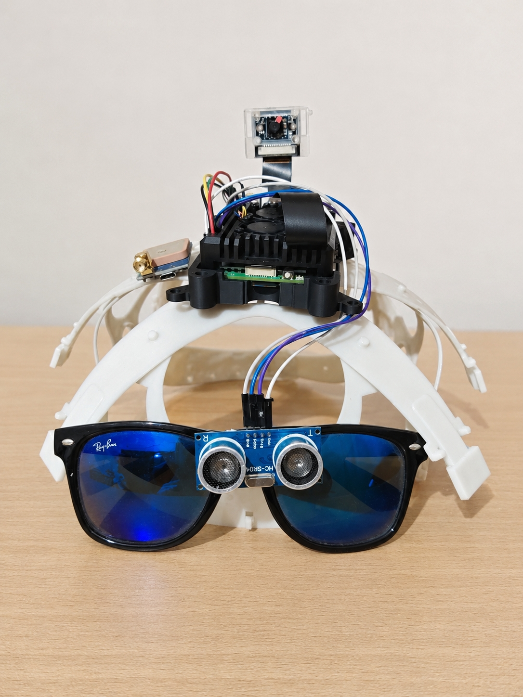
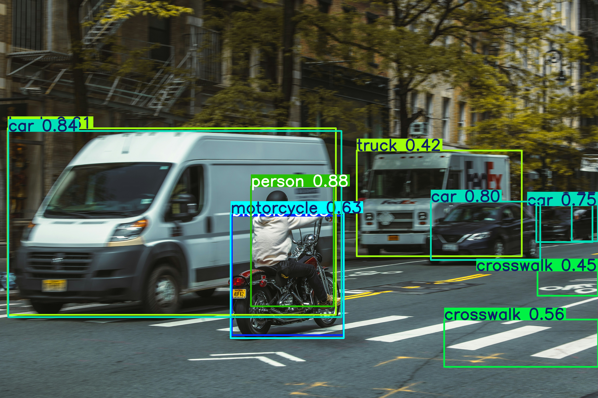
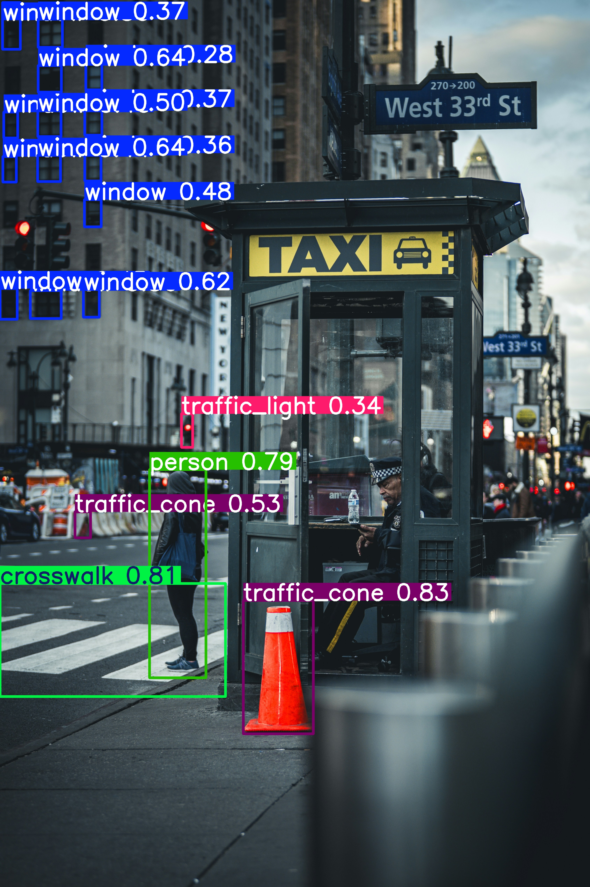

# Assistive Navigation System

**Assistive Navigation System** is an embedded assistance system designed for blind and visually impaired people. The project combines real-time object detection, distance estimation, danger prioritization, voice feedback, offline voice commands, GPS navigation, video recording, and SOS email alerts.

The system was developed as a smart-glasses prototype using a **Raspberry Pi 5**, a camera module, GPS, an ultrasonic sensor concept, Bluetooth audio output, and computer vision.



---

## Table of Contents

- [Project Overview](#project-overview)
- [Main Features](#main-features)
- [Hardware Used](#hardware-used)
- [Software Architecture](#software-architecture)
- [Project Structure](#project-structure)
- [Object Detection Model](#object-detection-model)
- [Detected Classes](#detected-classes)
- [How the System Works](#how-the-system-works)
- [Voice Commands](#voice-commands)
- [Installation](#installation)
- [Running on PC](#running-on-pc)
- [Running on Raspberry Pi](#running-on-raspberry-pi)
- [Navigation Setup](#navigation-setup)
- [SOS Email Setup](#sos-email-setup)
- [Recording Feature](#recording-feature)
- [Results](#results)
- [Troubleshooting](#troubleshooting)
- [Future Improvements](#future-improvements)
- [Author](#author)

---

## Project Overview

Blind and visually impaired people often face difficulties detecting obstacles, understanding their surroundings, moving safely, and receiving important information in real time.

This project proposes an assistive smart-glasses system capable of analyzing the environment and communicating useful information to the user through audio feedback. The system detects objects using a YOLOv8 model, estimates their approximate distance, determines their position relative to the user, and announces important information through text-to-speech.

The project also includes GPS-based pedestrian navigation, offline voice commands using Vosk, video recording, and SOS email alerts.

---

## Main Features

### Real-Time Object Detection

The system uses a YOLOv8 model to detect objects from the camera feed in real time. Detected objects are displayed with bounding boxes, confidence scores, estimated distance, and position.

### Distance Estimation

For each detected object, the system estimates the distance using:

- the real approximate width of the object,
- the camera focal length,
- the bounding box width in pixels.

The general formula is:

```text
distance = (real_object_width × focal_length) / object_width_in_pixels
```

### Object Position Estimation

The frame is divided into three zones:

- left,
- center / in front,
- right.

This allows the system to say messages such as:

```text
Person at 1.4 meters in front.
Car at 4.5 meters on the left.
```

### Danger Detection and Prioritization

The system gives priority to dangerous objects based on their distance and class. For example:

| Object | Danger Threshold |
|---|---:|
| Person | 1.5 m |
| Car | 5.0 m |
| Bus | 6.0 m |
| Motorcycle | 4.0 m |
| Stairs | 2.0 m |

When a dangerous object is detected, the system interrupts normal speech and announces a warning:

```text
Warning. Car is very close on the left.
```

### Voice Feedback

The system uses text-to-speech to inform the user about:

- detected objects,
- dangerous obstacles,
- navigation instructions,
- recording status,
- SOS status,
- system startup messages.

### Offline Voice Commands

Voice commands are recognized using **Vosk**, which works offline. This is useful because the system does not depend on an internet connection for command recognition.

### GPS Navigation

The navigation module uses GPS coordinates and a routing engine based on **Valhalla** and **OpenStreetMap** data. The system can guide the user to predefined places by voice.

### Video Recording

The user can start and stop recording using voice commands. The PC version records annotated video and audio using FFmpeg.

### SOS Email Alert

The SOS module can send an emergency email containing:

- alert time,
- current GPS location if available,
- a Google Maps link,
- emergency message.

---

## Hardware Used

The embedded prototype is based on the following components:

| Component | Role |
|---|---|
| Raspberry Pi 5 | Main processing board |
| IMX219 Camera Module | Captures real-time video |
| NEO-7M GPS Module | Provides user location |
| HC-SR04 Ultrasonic Sensor | Additional proximity detection concept |
| Bluetooth Headset / Speaker | Audio feedback output |
| Smart glasses / headset support | Mechanical support for the prototype |

> The PC version is mainly used for testing and development. The Raspberry Pi version is used for embedded deployment.

---

## Software Architecture

The system is organized into several modules:

| Module | Description |
|---|---|
| `vision/` | YOLOv8 detection, distance estimation, position estimation |
| `voice/` | Text-to-speech output |
| `agent/` | Voice commands, danger detection, SOS alert |
| `navigation/` | GPS management, places, Valhalla navigation |
| `recording_module/` | Video/audio recording |
| `models/` | YOLOv8 weights and Vosk speech recognition model |
| `main.py` | Main execution loop |

---

## Project Structure

```text
assistive-navigation-system/
│
├── for pc/
│  ├── agent/
│  │  ├── danger.py
│  │  ├── sos.py
│  │  └── voice_commands.py
│  │
│  ├── models/
│  │  ├── best.pt
│  │  ├── best502n.pt
│  │  └── vosk-model-small-en-us-0.15/
│  │
│  ├── navigation/
│  │  ├── gps/
│  │  │  └── gps_pc.py
│  │  ├── navigator.py
│  │  └── places.py
│  │
│  ├── recording_module/
│  │  ├── ffmpeg_recorder.py
│  │  └── recorder.py
│  │
│  ├── vision/
│  │  ├── vision_utils.py
│  │  └── yolo_vision.py
│  │
│  ├── voice/
│  │  └── tts.py
│  │
│  └── main.py
│
└── for raspberry/
  ├── agent/
  ├── models/
  ├── navigation/
  ├── recording_module/
  ├── vision/
  ├── voice/
  └── main.py
```

---

## Object Detection Model

The project uses **YOLOv8** for object detection. YOLOv8 was selected because it offers a good balance between detection accuracy, speed, and model size, which is important for real-time embedded systems such as Raspberry Pi.

Two model files are included:

```text
models/best.pt
models/best502n.pt
```

The default model used in the code is:

```python
models/best502n.pt
```

You can change the model path in:

```text
vision/yolo_vision.py
```

Inside:

```python
def init_model(model_path="models/best502n.pt"):
```

---

## Detected Classes

The custom model detects the following 24 classes:

| Class | Number of Images / Instances |
|---|---:|
| bicycle | 129 |
| bottle | 169 |
| bus | 134 |
| car | 1,641 |
| cat | 94 |
| cell_phone | 121 |
| chair | 243 |
| construction_barrier | 752 |
| crosswalk | 158 |
| dining_table | 44 |
| dog | 134 |
| door | 167 |
| hole | 206 |
| motorcycle | 164 |
| person | 1,877 |
| stairs | 66 |
| stop_sign | 53 |
| traffic_cone | 830 |
| traffic_light | 354 |
| train | 58 |
| tree | 361 |
| truck | 204 |
| window | 1,136 |

---

## How the System Works

The main loop performs the following steps:

1. Capture a frame from the camera.
2. Check if a voice command was recognized.
3. Run YOLOv8 object detection.
4. Estimate distance for each detected object.
5. Determine object position: left, right, or in front.
6. Check if one of the objects represents a danger.
7. Announce the most important information using text-to-speech.
8. Display the annotated frame.
9. Add the frame to the recorder if recording is active.
10. Continue navigation instructions if navigation mode is active.

---

## Voice Commands

The system supports several voice commands:

| Command | Action |
|---|---|
| `stop` | Stop normal speech feedback |
| `resume` | Resume speech feedback |
| `record` | Start video recording |
| `finish record` | Stop video recording |
| `danger` | Send SOS email alert |
| `help` | Send SOS email alert |
| `sos` | Send SOS email alert |
| `what is in front` | Analyze the front view |
| `guide me` | Start navigation mode |
| `navigate to ...` | Navigate to a known place |
| `take me to ...` | Navigate to a known place |
| `go to ...` | Navigate to a known place |
| `stop navigation` | Stop navigation mode |

Example:

```text
navigate to home
```

---

## Installation

### 1. Clone the Repository

```bash
git clone https://github.com/your-username/assistive-navigation-system.git
cd assistive-navigation-system
```

### 2. Create a Virtual Environment

#### Windows

```bash
python -m venv venv
venv\Scripts\activate
```

#### Linux / Raspberry Pi

```bash
python3 -m venv venv
source venv/bin/activate
```

### 3. Install Python Dependencies

```bash
pip install ultralytics opencv-python numpy supervision pyttsx3 vosk sounddevice requests scipy pyaudio pynmea2 pyserial
```

On Raspberry Pi, you may need:

```bash
sudo apt update
sudo apt install python3-pyaudio portaudio19-dev espeak ffmpeg
pip install picamera2
```

For PC recording with audio, install FFmpeg and add it to your system PATH.

---

## Running on PC

Go to the PC version folder:

```bash
cd "for pc"
```

Run:

```bash
python main.py
```

The system will:

- open the webcam,
- load the YOLOv8 model,
- start listening for voice commands,
- display the annotated camera feed,
- speak detected objects and warnings.

Press `ESC` to stop the program.

### Important PC Configuration

In `main.py`, change the output folder according to your computer:

```python
OUTPUT_FOLDER = "recorded_videos"
```

---

## Running on Raspberry Pi

Go to the Raspberry Pi version folder:

```bash
cd "for raspberry"
```

Run:

```bash
python3 main.py
```

The Raspberry Pi version uses:

- `Picamera2` for the camera,
- `Neo7MGPS` for GPS,
- YOLOv8 for detection,
- Vosk for offline voice commands,
- text-to-speech for audio output.

### Raspberry Pi Camera Configuration

If the camera is not detected, make sure the camera interface is enabled and correctly configured. On Raspberry Pi OS, check:

```bash
sudo raspi-config
```

Then enable the camera interface if needed.

For some camera modules, you may also need to verify the boot configuration depending on your Raspberry Pi OS version.

---

## Navigation Setup

The navigation module uses Valhalla as the routing engine:

```python
VALHALLA_URL = "http://localhost:8002/route"
```

This means Valhalla must be running locally before navigation can work.

The system sends a route request to Valhalla using pedestrian mode:

```json
"costing": "pedestrian"
```

Known destinations are stored in:

```text
navigation/places.py
```

To add a new place, add its name, latitude, and longitude to the places dictionary.

Example structure:

```python
PLACES = {
  "mall of sousse": {
    "name": "Mall of Sousse",
    "lat": 35.000000,
    "lon": 10.000000
  }
}
```

Then the user can say:

```text
navigate to Mall of Sousse
```

---

## SOS Email Setup

The SOS function is located in:

```text
agent/sos.py
```

Before using it, configure:

```python
sender = "your_email@gmail.com"
password = "your_app_password"
receiver = "receiver_email@gmail.com"
```

### Important Security Note

Do **not** publish your real email password or Gmail app password on GitHub.

Recommended approach:

- use environment variables,
- or keep credentials in a local `.env` file,
- add `.env` to `.gitignore`.

Example safer approach:

```python
sender = os.getenv("SOS_EMAIL")
password = os.getenv("SOS_EMAIL_PASSWORD")
receiver = os.getenv("SOS_RECEIVER")
```

---

## Recording Feature

In the PC version, recording is handled by:

```text
recording_module/ffmpeg_recorder.py
```

The user can start and stop recording by saying:

```text
record
finish record
```

The system records the annotated video and saves it as an MP4 file.

Make sure FFmpeg is installed:

```bash
ffmpeg -version
```

If the command is not recognized, install FFmpeg and add it to your PATH.

---

## Results

Add your detection screenshots and result images in a folder such as:

```text
assets/results/
```

Recommended structure:

```text
assets/
└── results/
  ├── detection_person_car.png
  ├── detection_traffic_cone.png
  ├── detection_stairs.png
  └── navigation_demo.png
```

### Detection Examples


#### Object Detection Result



#### Traffic Object Detection Result



#### Navigation / System Demo


You can also add a short demo video:

```markdown
[Watch the demo video](images/WhatsApp%20Video%202026-06-01%20at%204.13.16%20PM_detected_20260601_192239_with_audio.mp4)
```

---

## Troubleshooting

### Vosk Model Not Found

Error example:

```text
[VOICE] Vosk model not found
```

Solution:

Download the Vosk English model and extract it to:

```text
models/vosk-model-small-en-us-0.15/
```

### Camera Not Working on PC

Try changing the camera index:

```python
cap = cv2.VideoCapture(0, cv2.CAP_DSHOW)
```

Change `0` to `1` or `2` if you have multiple cameras.

### Camera Not Working on Raspberry Pi

Check that the camera is connected correctly and enabled. Test it with:

```bash
libcamera-hello
```

### FFmpeg Not Found

Install FFmpeg and check:

```bash
ffmpeg -version
```

### Microphone Not Detected

Check your microphone input and update the microphone device index in:

```text
recording_module/ffmpeg_recorder.py
```

### Navigation Not Working

Make sure Valhalla is running locally:

```text
http://localhost:8002/route
```

Also verify that GPS coordinates are valid.

### Raspberry Pi Recorder Note

The Raspberry Pi `main.py` imports a `PiRecorder` module. If your local project does not include `pi_recorder.py`, add the recorder file or temporarily disable recording in the Raspberry Pi version.

---

## Future Improvements

Possible improvements include:

- optimizing the YOLO model for Raspberry Pi using ONNX, NCNN, or TensorRT-compatible workflows,
- improving distance estimation using stereo vision or depth sensors,
- adding more object classes related to urban mobility,
- improving GPS accuracy,
- integrating obstacle detection from the ultrasonic sensor directly into the decision system,
- adding a mobile companion app,
- improving the mechanical design of the smart glasses prototype,
- adding multilingual voice commands and speech output.

---

## Author

**Mohamed Jouirou** 
Final Year Project — Embedded Systems / Electronics 
Project: Smart Glasses for Blind and Visually Impaired People

---

## License

This project is intended for academic and research purposes. You can add a license such as MIT if you want others to reuse or modify the code.

Example:

```text
MIT License
```

---

## Acknowledgements

This project uses several open-source technologies, including:

- YOLOv8 / Ultralytics,
- OpenCV,
- Vosk Speech Recognition,
- Valhalla Routing Engine,
- OpenStreetMap data,
- Python libraries for audio, GPS, and computer vision.
